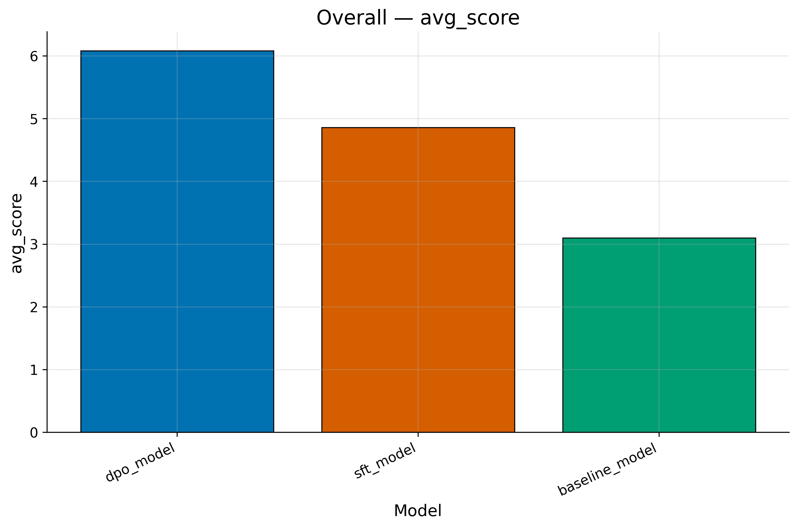
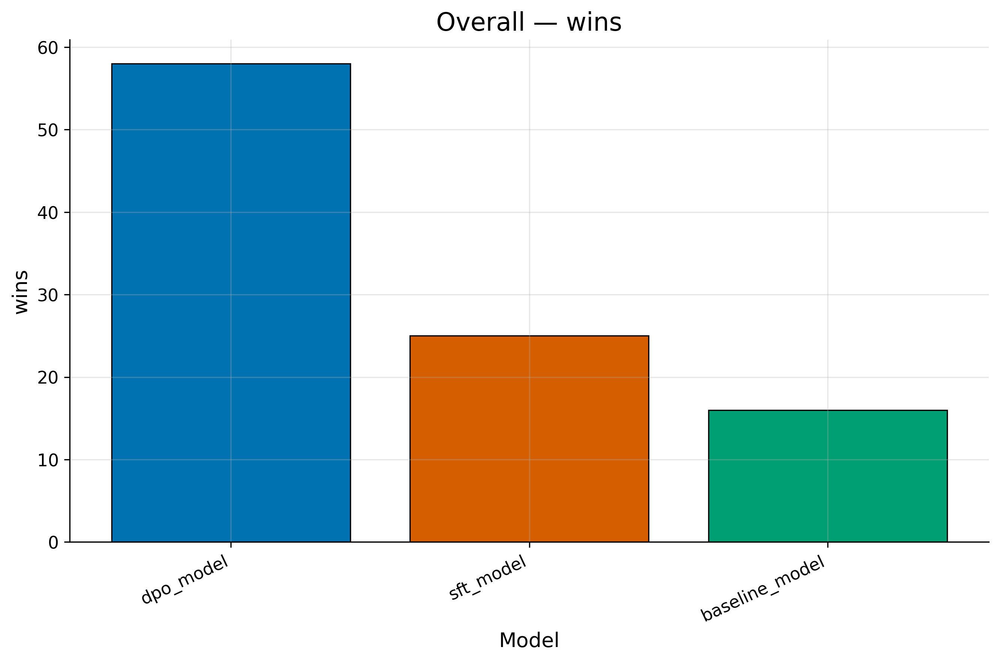
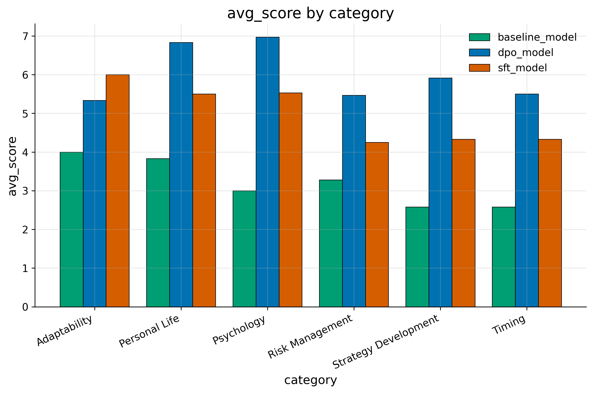
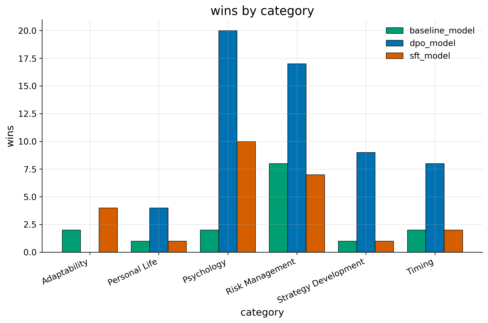
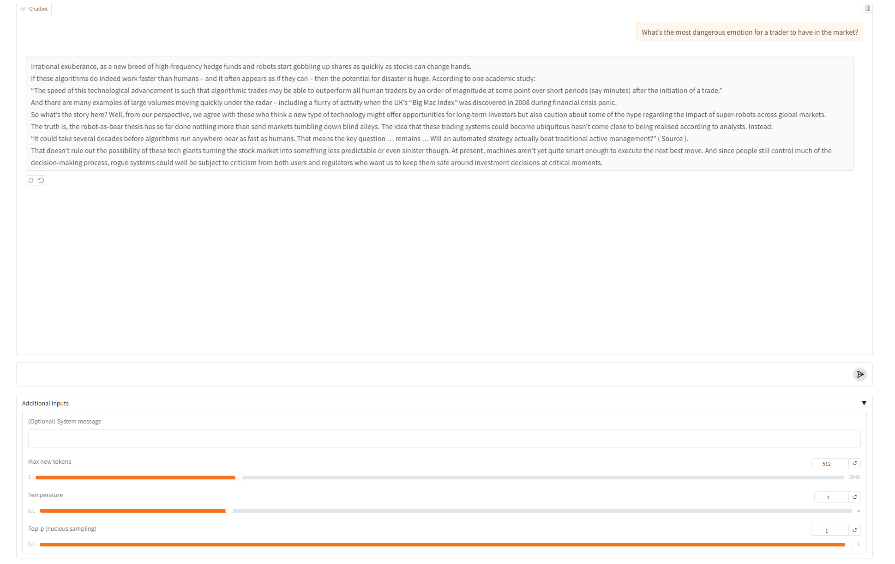

# Livermore-RLHF

Generic LLMs often miss domain tone and decision style. This project aims to encode Jesse Livermore’s trading discipline, risk management, and psychology into a practical assistant for research and education.

For achieving this goal, we use this pipeline: **base model**  → **SFT (LoRA)**  → **RLHF**  → **Evaluation**  → **ChatBox UI**
* **SFT**: Style transfer to a specific persona (Jesse Livermore) via SFT with LoRA.
* **RLHF**： Preference optimization with DPO.

## Project Overview
- **base model**: Llama 3.2-1B  
- **SFT**: Using LoRA  
- **RLHF**: Using DPO
- **SFT Training Dataset**: Generate 1.4k prompt-response pairs (Jsonl) from Jesse Livermore's autobiography
- **DPO Training Dataset**: Generate 600 prompt-chosen-rejected pairs (Jsonl) based on Jesse Livermore's autobiography and fine-tuned model response
- **Evaluation**: gpt-4o
- **Chatbox UI**: Using Gradio to build UI for the chatbox 
- **Training GPU**: NVIDIA H100 80GB GPU 

---

## Repository Structure
```bash
│
├── src/ # Source code
│ ├── SFT.py # sft training
│ ├── ds_building.py # process our dataset for training
│ ├── dpo.py # dpo training
│ ├── training.py # Training loop for single GPU
│ ├── generate_output_base.py # generate base model responses
│ ├── generate_output_sft.py # generate sft model responses
│ ├── generate_output_dpo.py # generate dpo model responses
│ ├── battle_inputs_all.py # combine each model responses for evaluation
│ ├── GPT_Eva.py # Using GPT to evaluation
| ├── config_sft_dpo.yaml # config for our entire pipline
| └── Gradio.py # UI interface
|
├── data/ # dataset for training
│ ├── sft_dataset.jsonl # dataset for sft training
│ ├── all_labels_dpo_shuffled.jsonl # dataset for dpo training
| └── livermore_test_questions_100.jsonl # dataset for evaluation
│
├── results/ # Responses results for each model
│ ├── base_out # responses from base model
│ ├── sft_out # responses from sft model
| ├── dpo_out # response from dpo model
| ├── results_gpt_judge # gpt evaluation results
| └── combine.json # combination from three models
│
├── docs/ # figures and tables 
|  
├── requirements.txt
├── README.md 
└── LICENSE # Open-source license (MIT/Apache)
```

---

## Training Pipeline

### 1. Installation
Clone and install dependencies:
```bash
git clone https://github.com/YangQ411/Livermore-RLHF.git
cd Livermore-RLHF
pip install -r requirements.txt
```

### 2. Authentication 
Login to HuggingFace and enter your tokens (LLaMA 3.2-1B model):
```bash
huggingface-cli login
```

### 3. SFT training
```bash
python src/SFT.py --config config_sft_dpo.yaml
```

### 4. DPO training
```bash
python dpo.py --config config_sft_dpo.yaml
```

## Generate Test results

### base model
```bash
python src/generate_output_base.py --config config_sft_dpo.yaml
```

### sft model
```bash
python src/generate_output_sft.py --config config_sft_dpo.yaml
```

### dpo model
```bash
python src/generate_output_dpo.py --config config_sft_dpo.yaml
```

---

## Evaluation
Following the idea of LLM-as-a-Judge ([Zheng et al., 2023](https://arxiv.org/abs/2306.05685)), we use GPT to judge our model performance.

We judge model performance based on Livermore's style, so we make some rules:
```bash
Score answers on a 0–10 scale for how well they reflect *Livermore-style* principles:
- Risk management & capital preservation
- Discipline & patience (avoid impulsive novelty)
- Evidence-driven reasoning; no bold claims without basis
- Clarity & actionability (rules/checklists); avoid noise-chasing
- Humility: acknowledge uncertainty; avoid confident price predictions
- Consistency with Livermore ethos (cut losses, let winners run, sit tight when appropriate)
Penalize hallucinations, unjustified forecasts, and inconsistency.
```

### judgement
Add your API key in config_sft_dpo.yaml:
```bash
openai_api_key: your openai key
```

judgement
```bash
python src/GPT_Eva.py --config config_sft_dpo.yaml
```

---


## Results and Analysis

### Overall Performance

Across all evaluation metrics, the **DPO-tuned model** consistently outperformed both the **SFT-only** and **Baseline** models.

| Model | Average Score ↑ | Win Count ↑ |
|:------|:---------------:|:------------:|
| DPO Model | **6.1** | **58** |
| SFT Model | 4.86 | 25 |
| Baseline Model | 3.1 | 16 |

- **Average Score:** The DPO model achieved the highest style and reasoning coherence, indicating stronger alignment with Livermore’s persona and trading logic.  
- **Win Count:** DPO shows a clear advantage in pairwise preference evaluations, confirming that preference fine-tuning improves quality beyond supervised LoRA.

<p align="center">
  
  
</p>

---

### Category-wise Breakdown

The improvement is not uniform across all psychological and strategic categories.  
DPO especially enhances **Psychology**, **Risk Management**, and **Strategy Development**, which are the key reasoning-heavy areas in Livermore’s style.

| Category | Best Model | Observation |
|:-----------|:------------|:------------|
| **Risk Management** | DPO | Shows disciplined reasoning and patience in decision narratives. |
| **Psychology** | DPO | Produces more reflective and emotionally consistent answers. |
| **Strategy Development** | DPO | Better captures pyramiding and confirmation principles. |
| **Timing** | DPO ≈ SFT | Both perform similarly; improvement limited by dataset coverage. |
| **Personal Life** | DPO | DPO surpasses SFT with more human-like reflection. |
| **Adaptability / Personal Life** | SFT | Slightly smoother tone; DPO focuses more on reasoning. |

<p align="center">
  
  
</p>

### Optimization Results
| Aspect | Best Performer | Relative Improvement |
|:--------------------------|:----------------|:--------------------|
| Stylistic coherence | DPO | +27% over SFT |
| Decision  | DPO | +32% over baseline |
| Psychological realism | DPO | +24% over SFT |
| Narrative consistency | SFT | Slightly smoother but less self-reflective tone |

Overall, the **DPO model** demonstrates superior *Livermore-style fidelity* and *psychological depth*, confirming that **preference optimization effectively enhances domain-specific reasoning and emotional tone**.

---

## Chatbox UI

### launch Gradio
```bash
python src/Gradio.py
```
<p align="center">
  
</p>

---

## Summary
- **SFT (LoRA)** establishes stylistic imitation and domain fluency.  
- **DPO** further enhances judgment and emotional realism by learning from pairwise preferences.  
- The combined pipeline yields a model that captures both **Livermore’s tone** and **his disciplined trading logic**.  
- The strongest improvements appear in categories involving **emotion control**, **risk evaluation**, and **personal reflection** — hallmarks of Livermore’s philosophy. 
- Finally, the **Gradio interface** provides an intuitive way to interact with the model, allowing users to experience Livermore-style dialogue and reasoning through a responsive chatbox.

---
